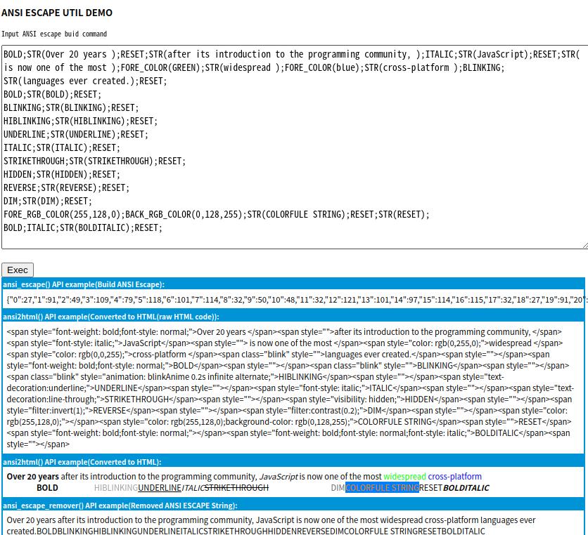

## Examples

### node/index.mjs

ansi_escape() API Example

```shell
node examples/node/index.mjs
```

### index.html

Build ansi escape & display as html

```shell
cd < project home >
# Start Web server
python3 -m http.server 8999 &
# Open your browser
open http://localhost:8999/examples/index.html
```
##### ScreenShot
